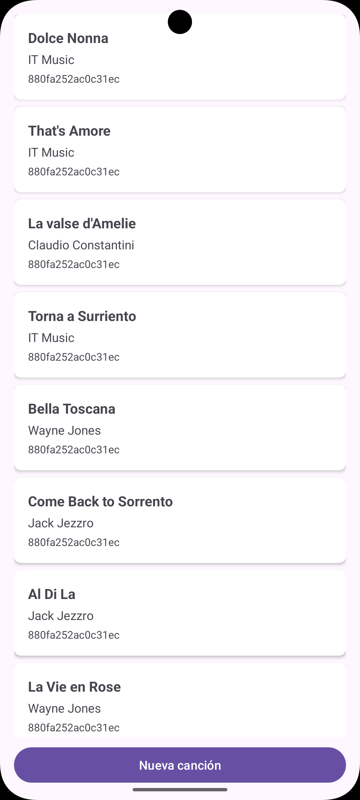
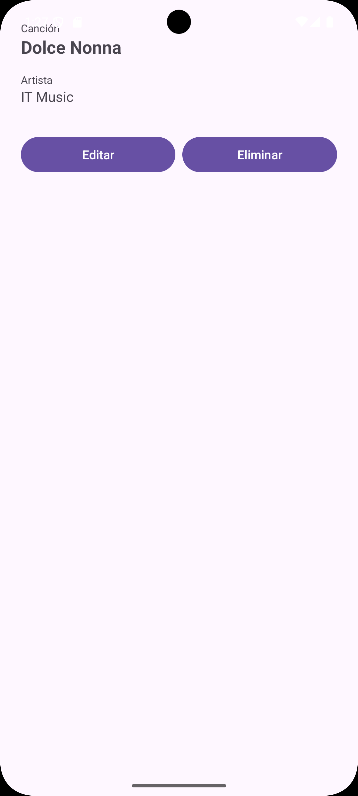
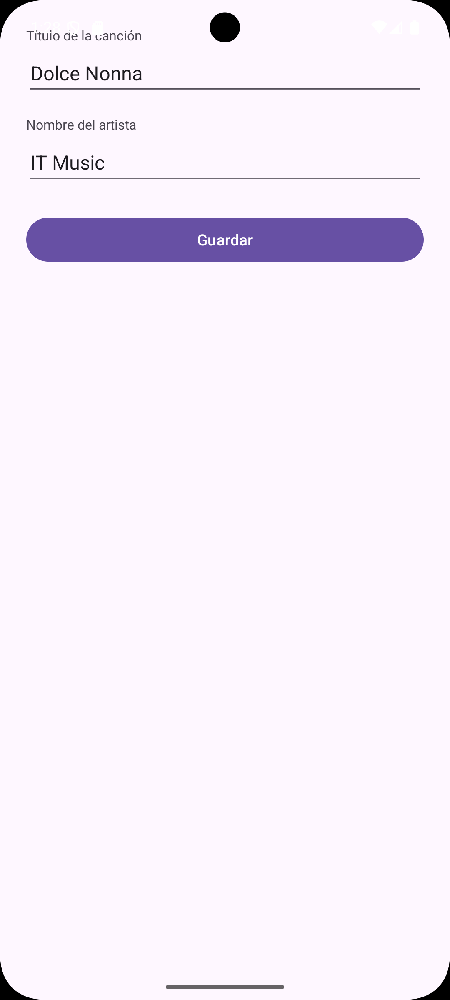

# SongCrudApp


Aplicación Android de ejemplo que implementa un CRUD completo de canciones consumiendo una API REST real con arquitectura en capas MVVM.

---

## 📖 Descripción del proyecto

**SongCrudApp** es una app Android pedagógica que te enseña a construir una aplicación real con arquitectura en capas. La app consume una API REST pública (MockAPI) para realizar las 4 operaciones del CRUD: crear, leer, actualizar y eliminar canciones. Cada canción tiene un título, un nombre de artista y un identificador de dispositivo (`id_student`) que se llena automáticamente desde el hardware del teléfono sin intervención del usuario. Además incluye pull-to-refresh para que el usuario pueda actualizar la lista manualmente deslizando hacia abajo.

---
## 📸 Capturas de pantalla

| Lista | Detalle | Formulario |
|-------|---------|------------|
|  |  |  |

## 📁 Arquitectura del proyecto

Este proyecto sigue una **arquitectura en tres capas** donde cada capa solo conoce a la inmediatamente inferior:

```
Presentation → Domain → Data → API
```

### Capas

| Capa | Responsabilidad |
|------|----------------|
| **data** | Modelos DTO que mapean el JSON, cliente Retrofit, DataSource que delega a la API |
| **domain** | Modelos de negocio limpios, Mapper que traduce entre capas, Repository como única fuente de verdad |
| **presentation** | Fragments que observan LiveData, ViewModel que orquesta las operaciones, Adapter del RecyclerView |

### Árbol de carpetas

```
com.app.servicecrudapp
├── data/
│   ├── model/SongDto.kt
│   ├── network/SongApiService.kt
│   ├── network/RetrofitClient.kt
│   └── datasource/SongRemoteDataSource.kt
├── domain/
│   ├── model/Song.kt
│   ├── mapper/SongMapper.kt
│   └── repository/SongRepository.kt
└── presentation/
    ├── MainActivity.kt
    ├── songlist/SongListFragment.kt
    ├── songlist/SongListViewModel.kt
    ├── songlist/SongListState.kt
    ├── songlist/SongAdapter.kt
    ├── songdetail/SongDetailFragment.kt
    ├── songform/SongFormFragment.kt
    └── util/Util.kt
```

---

## 🗺️ Flujo de navegación

La app tiene **3 pantallas** implementadas como Fragments. La navegación usa **Navigation Component** con `nav_graph.xml`. Los datos entre pantallas se pasan como `Bundle` mediante `bundleOf()` + `R.id` de la acción correspondiente (sin Safe Args, por compatibilidad con AGP 9.x).

```
SongListFragment
    ├── "Nueva canción" ──────→ SongFormFragment (modo creación)
    └── tap ítem ─────────────→ SongDetailFragment
                                    ├── Editar ──→ SongFormFragment (modo edición)
                                    └── Eliminar → (AlertDialog) → popBackStack
```

- **SongListFragment** — muestra la lista de canciones con RecyclerView y soporte de pull-to-refresh.
- **SongDetailFragment** — muestra el detalle de la canción seleccionada y permite editarla o eliminarla.
- **SongFormFragment** — formulario reutilizable: si recibe un `songId` vacío opera en modo creación; si recibe un `songId` con valor opera en modo edición con los campos pre-llenados.

---

## 🔌 API utilizada

**MockAPI** — API REST pública sin autenticación.

- **URL base:** `https://66c7791d732bf1b79fa6a746.mockapi.io/songs`
- **Recurso:** `/users`

### Endpoints

| Método | Endpoint | Descripción |
|--------|----------|-------------|
| GET | /users | Obtener lista de canciones |
| GET | /users/{id} | Obtener una canción por ID |
| POST | /users | Crear una nueva canción |
| PUT | /users/{id} | Actualizar una canción existente |
| DELETE | /users/{id} | Eliminar una canción |

### Modelo JSON

```json
{
  "id": "1",
  "name": "name 1",
  "song": "song 1",
  "id_student": "abc123def456"
}
```

> **Nota:** el campo `id_student` se llena automáticamente desde el dispositivo mediante `Settings.Secure.ANDROID_ID`. El usuario nunca lo ingresa manualmente — el `SongListViewModel` lo obtiene del hardware antes de enviar el request a la API.

---

## 🛠️ Tecnologías y dependencias

| Librería | Versión | Uso |
|----------|---------|-----|
| Kotlin | AGP 9.2.1 (integrado) | Lenguaje principal |
| Retrofit 2 | 2.9.0 | Cliente HTTP para consumir la API REST |
| Gson converter | 2.9.0 | Deserialización del JSON de respuesta |
| OkHttp Logging Interceptor | 4.12.0 | Logs de cada petición HTTP en Logcat |
| Coroutines | 1.7.3 | Llamadas asíncronas sin bloquear el hilo principal |
| ViewModel + LiveData | 2.7.0 | Estado de UI y observación reactiva |
| Navigation Component | 2.9.0 | Navegación declarativa entre Fragments |
| SwipeRefreshLayout | 1.1.0 | Gesto pull-to-refresh en la pantalla de lista |
| ViewBinding | — | Acceso seguro y sin `findViewById` a las vistas XML |
| Material Design | 1.14.0 | Componentes visuales de Material 3 |

---

## 🚀 Cómo correr el proyecto

1. **Clona el repositorio**
   ```bash
   git clone https://github.com/tu-usuario/SongCrudApp.git
   ```

2. **Abre el proyecto en Android Studio**
   Usa Android Studio **Ladybug** o superior (requerido para AGP 9.x).

3. **Espera el sync de Gradle**
   Android Studio descargará automáticamente todas las dependencias.

4. **Conecta un dispositivo o inicia un emulador**
   El dispositivo o emulador debe tener **API 24 o superior**.

5. **Presiona Run ▶**
   La app se instalará y abrirá automáticamente.

> **Nota:** el permiso `INTERNET` ya está declarado en el `AndroidManifest.xml`. Los logs de red son visibles en **Logcat** filtrando por el tag `OkHttp` — solo activos en builds de debug.

---

## 🎓 Conceptos que aprenderás con este proyecto

- Arquitectura en capas **(data / domain / presentation)**
- Patrón **MVVM** con `AndroidViewModel` y `LiveData`
- Consumo de **API REST** con Retrofit y Coroutines
- **Navigation Component** con `nav_graph.xml` y Bundle
- Paso de datos entre Fragments con **`bundleOf()`** sin Safe Args
- **ViewBinding** para acceso seguro a vistas XML
- **Sealed class** para manejo de estados (`Loading` / `Success` / `Error`)
- **Mapper** para separar el modelo de red del modelo de dominio
- Pull-to-refresh con **`SwipeRefreshLayout`**
- Logging de red con **`HttpLoggingInterceptor`**
- Obtención del identificador de dispositivo con **`ANDROID_ID`**

---

## 📚 Glosario rápido

| Término | Qué es en palabras simples |
|---------|---------------------------|
| DTO | Objeto que representa exactamente lo que devuelve la API |
| Mapper | Traductor entre el modelo de la API y el modelo de la app |
| Repository | El único punto de contacto entre el ViewModel y la fuente de datos |
| AndroidViewModel | ViewModel que además puede acceder al contexto de la aplicación |
| LiveData | Variable observable — cuando cambia, la UI se actualiza sola |
| Sealed class | Tipo cerrado de opciones — perfecto para representar estados |
| ViewBinding | Elimina el `findViewById` y evita errores de tipo en las vistas |
| Coroutine | Forma de hacer tareas asíncronas (como llamadas a red) sin bloquear la UI |
| NavController | El componente que controla qué Fragment se muestra en cada momento |
| bundleOf | Forma compacta de crear un Bundle para pasar datos entre Fragments |
| HttpLoggingInterceptor | Interceptor que imprime cada petición HTTP en el Logcat |
| ANDROID_ID | Identificador único del dispositivo proporcionado por Android |

---

## 👤 Autor

**Tu nombre**
- GitHub: [@tu-usuario](https://github.com/tu-usuario)

## 📄 Licencia

Este proyecto está bajo la licencia [MIT](LICENSE).

---

<div align="center">

## 🇺🇸 English version below

</div>

---

# SongCrudApp


Android sample application that implements a full CRUD for songs consuming a real REST API with MVVM layered architecture.

---

## 📖 Project description

**SongCrudApp** is a pedagogical Android app that teaches you how to build a real application with layered architecture. The app consumes a public REST API (MockAPI) to perform the 4 CRUD operations: create, read, update and delete songs. Each song has a title, an artist name and a device identifier (`id_student`) that is automatically filled from the phone hardware without any user input. It also includes pull-to-refresh so the user can manually update the list by swiping down.

---

## 📸 Screenshots

> Replace the placeholders with real screenshots from your device or emulator.

| List | Detail | Form |
|------|--------|------|
| _screenshot_ | _screenshot_ | _screenshot_ |

---

## 📁 Project architecture

This project follows a **three-layer architecture** where each layer only knows the one immediately below it:

```
Presentation → Domain → Data → API
```

### Layers

| Layer | Responsibility |
|-------|---------------|
| **data** | DTO models that map JSON, Retrofit client, DataSource that delegates to the API |
| **domain** | Clean business models, Mapper that translates between layers, Repository as the single source of truth |
| **presentation** | Fragments that observe LiveData, ViewModel that orchestrates operations, RecyclerView Adapter |

### Folder tree

```
com.app.servicecrudapp
├── data/
│   ├── model/SongDto.kt
│   ├── network/SongApiService.kt
│   ├── network/RetrofitClient.kt
│   └── datasource/SongRemoteDataSource.kt
├── domain/
│   ├── model/Song.kt
│   ├── mapper/SongMapper.kt
│   └── repository/SongRepository.kt
└── presentation/
    ├── MainActivity.kt
    ├── songlist/SongListFragment.kt
    ├── songlist/SongListViewModel.kt
    ├── songlist/SongListState.kt
    ├── songlist/SongAdapter.kt
    ├── songdetail/SongDetailFragment.kt
    ├── songform/SongFormFragment.kt
    └── util/Util.kt
```

---

## 🗺️ Navigation flow

The app has **3 screens** implemented as Fragments. Navigation uses **Navigation Component** with `nav_graph.xml`. Data between screens is passed as `Bundle` using `bundleOf()` + `R.id` of the corresponding action (no Safe Args, for AGP 9.x compatibility).

```
SongListFragment
    ├── "Nueva canción" ──────→ SongFormFragment (create mode)
    └── tap item ─────────────→ SongDetailFragment
                                    ├── Edit ────→ SongFormFragment (edit mode)
                                    └── Delete ──→ (AlertDialog) → popBackStack
```

- **SongListFragment** — displays the song list with RecyclerView and pull-to-refresh support.
- **SongDetailFragment** — shows the details of the selected song and allows editing or deleting it.
- **SongFormFragment** — reusable form: if it receives an empty `songId` it operates in create mode; if it receives a `songId` with a value it operates in edit mode with pre-filled fields.

---

## 🔌 API used

**MockAPI** — Public REST API, no authentication required.

- **Base URL:** `https://66c7791d732bf1b79fa6a746.mockapi.io/songs`
- **Resource:** `/users`

### Endpoints

| Method | Endpoint | Description |
|--------|----------|-------------|
| GET | /users | Get list of songs |
| GET | /users/{id} | Get a song by ID |
| POST | /users | Create a new song |
| PUT | /users/{id} | Update an existing song |
| DELETE | /users/{id} | Delete a song |

### JSON model

```json
{
  "id": "1",
  "name": "name 1",
  "song": "song 1",
  "id_student": "abc123def456"
}
```

> **Note:** the `id_student` field is automatically populated from the device via `Settings.Secure.ANDROID_ID`. The user never enters it manually — the `SongListViewModel` retrieves it from the hardware before sending the request to the API.

---

## 🛠️ Technologies and dependencies

| Library | Version | Purpose |
|---------|---------|---------|
| Kotlin | AGP 9.2.1 (built-in) | Main language |
| Retrofit 2 | 2.9.0 | HTTP client to consume the REST API |
| Gson converter | 2.9.0 | Deserialization of JSON responses |
| OkHttp Logging Interceptor | 4.12.0 | Logs every HTTP request in Logcat |
| Coroutines | 1.7.3 | Async calls without blocking the main thread |
| ViewModel + LiveData | 2.7.0 | UI state management and reactive observation |
| Navigation Component | 2.9.0 | Declarative navigation between Fragments |
| SwipeRefreshLayout | 1.1.0 | Pull-to-refresh gesture on the list screen |
| ViewBinding | — | Safe view access without `findViewById` |
| Material Design | 1.14.0 | Material 3 visual components |

---

## 🚀 How to run the project

1. **Clone the repository**
   ```bash
   git clone https://github.com/your-username/SongCrudApp.git
   ```

2. **Open the project in Android Studio**
   Use **Android Studio Ladybug** or later (required for AGP 9.x).

3. **Wait for Gradle sync**
   Android Studio will automatically download all dependencies.

4. **Connect a device or start an emulator**
   The device or emulator must have **API 24 or higher**.

5. **Press Run ▶**
   The app will be installed and launched automatically.

> **Note:** the `INTERNET` permission is already declared in `AndroidManifest.xml`. Network logs are visible in **Logcat** by filtering with the tag `OkHttp` — only active in debug builds.

---

## 🎓 Concepts you will learn with this project

- Layered architecture **(data / domain / presentation)**
- **MVVM** pattern with `AndroidViewModel` and `LiveData`
- **REST API** consumption with Retrofit and Coroutines
- **Navigation Component** with `nav_graph.xml` and Bundle
- Passing data between Fragments with **`bundleOf()`** without Safe Args
- **ViewBinding** for safe XML view access
- **Sealed class** for state management (`Loading` / `Success` / `Error`)
- **Mapper** to separate the network model from the domain model
- Pull-to-refresh with **`SwipeRefreshLayout`**
- Network logging with **`HttpLoggingInterceptor`**
- Retrieving device identifier with **`ANDROID_ID`**

---

## 📚 Quick glossary

| Term | What it is in plain words |
|------|--------------------------|
| DTO | Object that represents exactly what the API returns |
| Mapper | Translator between the API model and the app model |
| Repository | The single point of contact between the ViewModel and the data source |
| AndroidViewModel | ViewModel that can also access the application context |
| LiveData | Observable variable — when it changes, the UI updates itself |
| Sealed class | A closed set of options — perfect for representing states |
| ViewBinding | Eliminates `findViewById` and avoids type errors in views |
| Coroutine | A way to run async tasks (like network calls) without blocking the UI |
| NavController | The component that controls which Fragment is shown at any time |
| bundleOf | Compact way to create a Bundle to pass data between Fragments |
| HttpLoggingInterceptor | Interceptor that prints every HTTP request in Logcat |
| ANDROID_ID | Unique device identifier provided by Android |

---

## 👤 Author

**Your name**
- GitHub: [@marlonpya](https://github.com/marlonpya)
